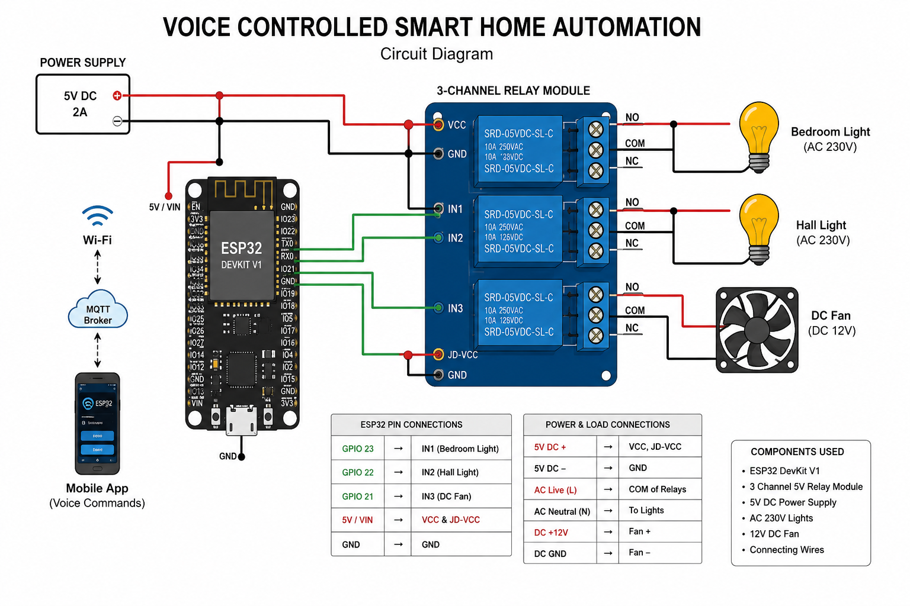

# 🏠 Voice Controlled Smart Home Automation using MQTT Protocol

[](LICENSE)
[]()
[]()

## 📌 Project Overview

The **Voice Controlled Smart Home Automation System** is an IoT-based embedded systems project developed using the **ESP32 microcontroller**, **MQTT communication protocol**, and a **web/mobile dashboard** for real-time smart appliance control.

This system enables users to control home appliances through **voice commands** as well as manual dashboard controls over Wi-Fi. Commands are processed through the application dashboard and transmitted using MQTT protocol to the ESP32 controller, which executes appliance switching through a relay module.

The project demonstrates practical implementation of:

- Embedded Systems Engineering
- Internet of Things (IoT)
- MQTT Publish-Subscribe Communication
- ESP32 Wireless Control
- Voice Command Processing
- Smart Home Automation
- Relay-Based Appliance Switching
- Web Dashboard Integration

---

## 🎯 Project Objectives

The primary objectives of this project are:

- Design a smart home automation system using IoT technologies
- Enable voice-based control of household appliances
- Implement lightweight MQTT communication for real-time messaging
- Develop a responsive smart dashboard interface
- Reduce manual appliance control effort
- Build scalable architecture for future automation expansion

---

## 🚀 Features

### Core Features
✅ Voice-controlled appliance operation  
✅ Real-time MQTT communication  
✅ Wi-Fi based wireless automation  
✅ Smart web/mobile dashboard control  
✅ Low latency communication  
✅ Lightweight embedded implementation  
✅ Manual appliance switching support  
✅ Expandable architecture for future devices  

---

## 💡 Controlled Appliances

| Appliance | Function |
|---------|----------|
| Bedroom Light | ON / OFF |
| Hall Light | ON / OFF |
| DC Fan | ON / OFF |

---

## 📱 Live Dashboard

Access the live dashboard here:

🔗 **https://home-automation-voice-control.netlify.app**

---

## 📸 Mobile Application Dashboard


The dashboard supports:

- Voice command recognition
- Manual ON/OFF control
- Appliance status display
- Real-time command execution
- Mobile responsive UI

Example commands:

```text
Turn on bedroom light
Turn off hall light
Toggle fan
Reset all
```

---

## 🏗 System Architecture

```text
User Voice Command
        ↓
Web / Mobile Dashboard
        ↓
Speech Recognition Processing
        ↓
MQTT Publish Command
        ↓
MQTT Broker
        ↓
ESP32 MQTT Subscriber
        ↓
Command Processing
        ↓
Relay Module
        ↓
Bedroom Light / Hall Light / DC Fan
```

---

## 📡 MQTT Workflow

1. User gives voice command through dashboard
2. Speech recognition converts voice into command text
3. Dashboard publishes command to MQTT broker
4. ESP32 subscribes to MQTT topics
5. ESP32 receives and processes commands
6. Relay module switches corresponding appliance
7. Appliance state updates in real time

---

## 📖 About MQTT Protocol

MQTT (**Message Queuing Telemetry Transport**) is a lightweight messaging protocol designed specifically for IoT communication.

It follows a **publish-subscribe architecture**, making it ideal for smart automation systems.

### Why MQTT?

- Lightweight protocol
- Fast communication
- Low bandwidth usage
- Reliable message delivery
- Scalable architecture
- Perfect for IoT devices

---

## 🛠 Technologies Used

### Hardware
- ESP32 Development Board
- 3 Channel Relay Module
- DC Fan
- LED Lights
- Breadboard
- Jumper Wires
- Power Supply
- Wi-Fi Router

### Software
- Arduino IDE
- MQTT Broker (HiveMQ / Mosquitto)
- HTML
- CSS
- JavaScript
- Embedded C / Arduino Programming

### Communication Protocol
- MQTT

---

## 🔌 Hardware Connections

| Component | ESP32 Pin |
|----------|-----------|
| Bedroom Light Relay | GPIO 23 |
| Hall Light Relay | GPIO 22 |
| DC Fan Relay | GPIO 21 |
| Relay VCC | 5V |
| Relay GND | GND |

---

## 🔧 Circuit Diagram



---

## 📂 Project Structure

```text
smart-home-automation-mqtt/
│
├── README.md
├── LICENSE
├── .gitignore
├── smart_home_automation_mqtt.ino
├── circuit_diagram.png
├── app_dashboard.png
├── project_demo.mp4
├── project_presentation.pptx
├── libraries_used.txt
├── mqtt_topics.txt
└── pin_connections.txt
```

---

## 📚 Required Libraries

Arduino libraries used:

```cpp
WiFi.h
PubSubClient.h
ArduinoJson.h
```

Install from Arduino Library Manager.

---

## ⚙ Installation Guide

### 1. Clone Repository

```bash
git clone https://github.com/Girish-Pasupuleti/smart-home-automation-mqtt.git
```

---

### 2. Open Arduino IDE

Install Arduino IDE.

---

### 3. Install ESP32 Board Package

Go to:

```text
Tools → Board Manager → Search ESP32
```

Install ESP32 package.

---

### 4. Install Libraries

Install:

- WiFi
- PubSubClient
- ArduinoJson

---

### 5. Configure Wi-Fi

Update credentials:

```cpp
const char* ssid = "Girish's iphone";
const char* password = "1234567890";
```

---

### 6. Configure MQTT Broker

```cpp
const char* mqtt_server = "broker.hivemq.com";
```

---

### 7. Upload Code

Select ESP32 board and upload:

```text
smart_home_automation_mqtt.ino
```

---

### 8. Connect Hardware

Follow circuit diagram.

---

### 9. Launch Dashboard

Open:

```text
https://home-automation-voice-control.netlify.app
```

Use voice/manual control.

---

## 🎥 Project Demo

Demo video included:

```text
project_demo.mp4
```

---

## 📑 Documentation

Project presentation included:

```text
project_presentation.pptx
```

---

## 🧠 Challenges Faced

- MQTT connection debugging
- Wi-Fi stability handling
- Relay switching synchronization
- Voice recognition accuracy
- Dashboard responsiveness
- Real-time device state handling

---

## 🔮 Future Enhancements

- Temperature sensor integration
- Humidity monitoring
- Appliance scheduling
- Energy consumption monitoring
- Google Assistant integration
- Alexa integration
- Firebase cloud dashboard
- Device authentication
- Remote internet access

---

## 🌍 Applications

- Smart homes
- IoT automation
- Voice-controlled embedded systems
- Remote appliance management
- Assistive smart automation

---

## 📈 Project Outcome

Successfully developed a voice-controlled IoT smart home automation system capable of controlling multiple appliances in real time using MQTT communication, ESP32 embedded control, and a responsive dashboard interface.

---

## 👨‍💻 Author

**Girish Pasupuleti**  
Embedded Systems | IoT | AI/ML Enthusiast

🔗 GitHub: https://github.com/Girish-Pasupuleti  
🔗 Live Dashboard: https://home-automation-voice-control.netlify.app

---

## 📜 License

This project is licensed under the MIT License.
